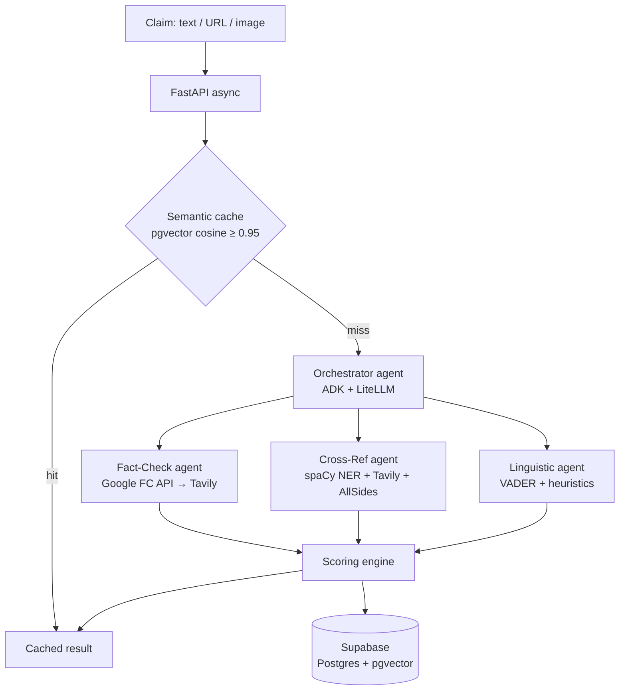

# VeriFact AI

> Multi-agent AI pipeline that turns a suspicious claim — text, URL, or screenshot — into a visual, source-backed credibility score in under 10 seconds. Parallel fact-check, cross-reference, and linguistic agents produce a transparent composite trust score with citations. **Not a chatbot.**

<p>
  
  
  
  
</p>

---

## Why this exists

Misinformation spreads roughly **6× faster** than corrections. Existing tools are either academic-grade text reports nobody reads on their phone, or chatbot wrappers around a single LLM that *hallucinate confidence without citing sources*.

VeriFact AI takes a different approach: a **multi-agent verification pipeline** that decomposes credibility into measurable signals, scores each independently, and shows its work. When it doesn't have enough evidence, it says so instead of fabricating certainty.

## What it does

- **Three input modes** — paste text, drop a URL, or upload a screenshot (OCR).
- **Composite trust score (0–100)** with a transparent breakdown, not a black-box verdict.
- **Citations for everything** — which fact-check matched, which outlets corroborated, what linguistic patterns were detected.
- **Honest confidence** — a calibrated indicator that flags "insufficient sources" rather than overstating.
- **Political bias labels from static AllSides data only** — never generated by the LLM.

## How it works



Worker agents run **in parallel** under the orchestrator, each with an **8-second timeout**. A failed or timed-out agent degrades gracefully (neutral value + "Partial Analysis" flag) — it never crashes the pipeline or fabricates a score.

### The trust score

```
C_total = w1·S_fact + w2·(1 − B_ling) + w3·V_consensus
```

| Signal | Meaning | Source |
|--------|---------|--------|
| **S_fact** | Fact-check match score | Google Fact Check Tools API (free) → Tavily, scoped to fact-check domains |
| **B_ling** | Linguistic volatility (clickbait, emotion, sensationalism, density) | VADER + heuristics |
| **V_consensus** | Source corroboration across the bias spectrum | spaCy NER + Tavily + AllSides |

The scoring engine is **pure and deterministic** (`Σw = 1.0`, `w1 ≥ 0.4`, output clamped to `[0,1]`) with confidence-capping rules — e.g. no fact-check found **and** weak corroboration → score is capped and a low-confidence warning is shown.

## Tech stack

| Layer | Choice |
|-------|--------|
| Backend | Python 3.12+, FastAPI (async), managed with [`uv`](https://docs.astral.sh/uv/) |
| Agents | Google ADK + LiteLLM — model swapped via config (dev: `groq/llama-3.1-8b-instant`) |
| Database | Supabase (Postgres + pgvector) |
| Embeddings | `all-MiniLM-L6-v2` (384-dim) dev · `BAAI/bge-m3` (1024-dim) prod — dimension is a config var |
| Frontend | Vite + React + Tailwind + Recharts (mobile-first, 375px baseline) |
| Eval | DeepEval + custom harness |

## Project structure

```
backend/app/{api,agents,scoring,services,db,utils}   # FastAPI + ADK pipeline
frontend/src/{components,hooks,styles}               # React dashboard
eval/{datasets,tests,metrics}                        # evaluation & guardrails
data/                                                # AllSides ratings, seed claims
documents/                                           # PRD, TDD, build order (source of truth)
```

## Getting started

### Prerequisites

- Python 3.12+ and [`uv`](https://docs.astral.sh/uv/getting-started/installation/)
- A Supabase project (Postgres + pgvector enabled)
- API keys: [Groq](https://console.groq.com), [Tavily](https://tavily.com), [Google Fact Check Tools](https://developers.google.com/fact-check/tools/api) (all have free tiers)

### Backend

```bash
# 1. Configure secrets
cp .env.example .env        # then fill in your keys

# 2. Install dependencies (from backend/)
cd backend
uv sync

# 3. Run the dev server
uv run uvicorn app.main:app --reload

# 4. Verify
curl localhost:8000/health   # → {"status":"ok"}
```

Run tests with `uv run pytest`.

### Frontend

> Scaffolded in Phase 2 — see the roadmap below. Once present: `cd frontend && npm install && npm run dev`.

## Project status

Active development, built in phases (see [`documents/VeriFact_AI_Build_Order.md`](documents/VeriFact_AI_Build_Order.md)):

- ✅ **Phase 0 — Foundation:** scaffolding, FastAPI skeleton, Supabase connection, config, AllSides bias lookup
- 🚧 **Phase 1 — Core pipeline:** fact-check agent + services done; cross-ref / linguistic agents, scoring engine, semantic cache, orchestrator, and API routes still to come
- 🔜 **Phase 2 — Multi-modal + frontend:** OCR, URL scraper, React dashboard
- 🔜 **Phase 3 — Evaluation & polish:** curated eval set, guardrails, calibration, deployment

## Design principles

- **Never fabricate certainty.** "I don't have enough information" is a correct answer.
- **Bias ratings come only from AllSides static data** — the LLM never generates a political label (zero-tolerance guardrail).
- **Secrets stay server-side**, loaded from `.env`; never exposed to the frontend or logged.
- **Agents degrade gracefully** — partial results over crashes, never a fabricated score when all agents fail.

## Documentation

The canonical spec lives in [`documents/`](documents/): product requirements (PRD), technical design (TDD), phased build order, and the open-source stack & evaluation framework.

## License

To be determined.
